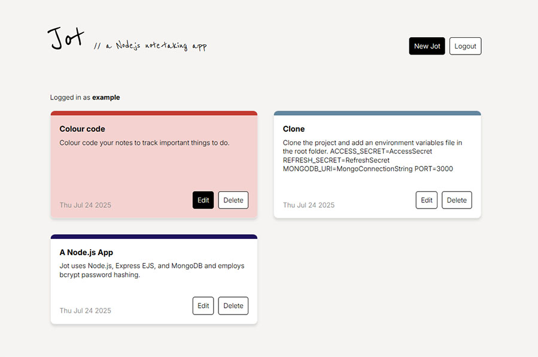

# Jot
A secure note-taking app using Node.js, Express, EJS, and MongoDB.

## Features
* JWT user authentication with bcrypt hashing
* CRUD operations on notes
* Colour-coded notes
* Simple, responsive UI

## Screenshot


## Setup
### Prerequisites
1. Node.js
    1. Ensure `node` and `npm` are available in the command line.
2. MongoDB, running locally or remote.

### Environment variables
Create a .env file the project's root directory.
```
MONGO_URL=mongodb://localhost:27017/DatabaseName
ACCESS_SECRET=AccessSecret
REFRESH_SECRET=RefreshSecret
PORT=3000
```

## Installation
```
git clone https://github.com/kyle-strachan/jot_app.git
cd jot_app
npm install
```

## Run locally
```
npm start
```

## API Endpoints

### Auth Routes

| Method | Endpoint      | Description               |
|--------|---------------|---------------------------|
| POST   | `/register`   | Register a new user       |
| POST   | `/login`      | Log in and receive tokens |
| POST   | `/logout`     | Log out and clear cookies |

### Notes Routes

| Method | Endpoint           | Description                      |
|--------|--------------------|----------------------------------|
| GET    | `/notes`           | View all notes for logged-in user |
| GET    | `/notes/new`       | Show form to create a new note  |
| POST   | `/notes`           | Create a new note               |
| GET    | `/notes/:id/edit`  | Show edit form for a note       |
| PUT    | `/notes/:id`       | Update a note                   |
| DELETE | `/notes/:id`       | Delete a note                   |

## Future Development
1. Bug: New lines are not saved.
2. Introduce a search function